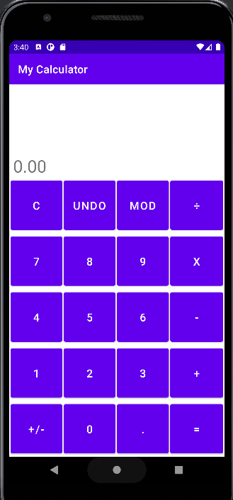

# MyBasicCalculator
A basic calculator developed using Android Studio.

Includes 5 binary operators and a negation operator.
Equations can be extended with additional operators and operands.

DEMO

